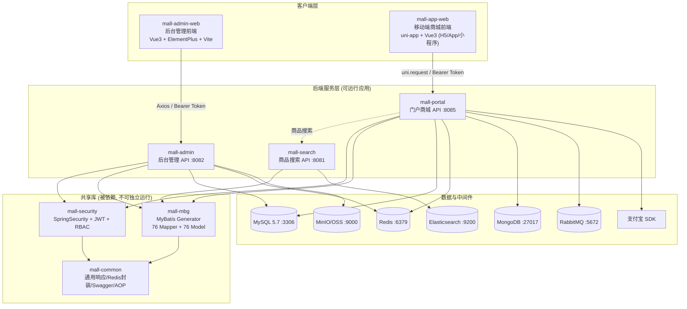
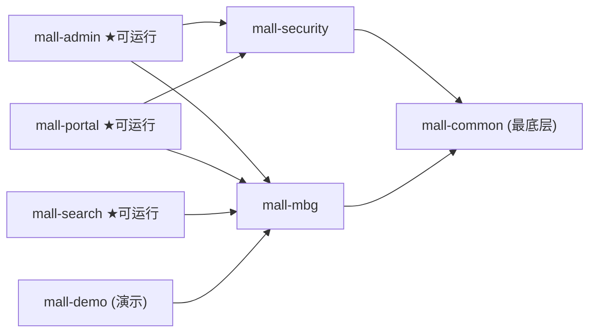
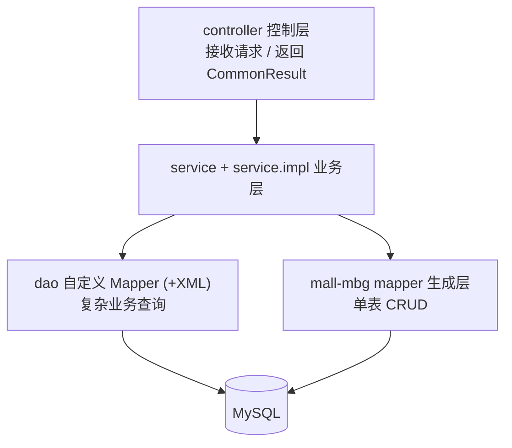
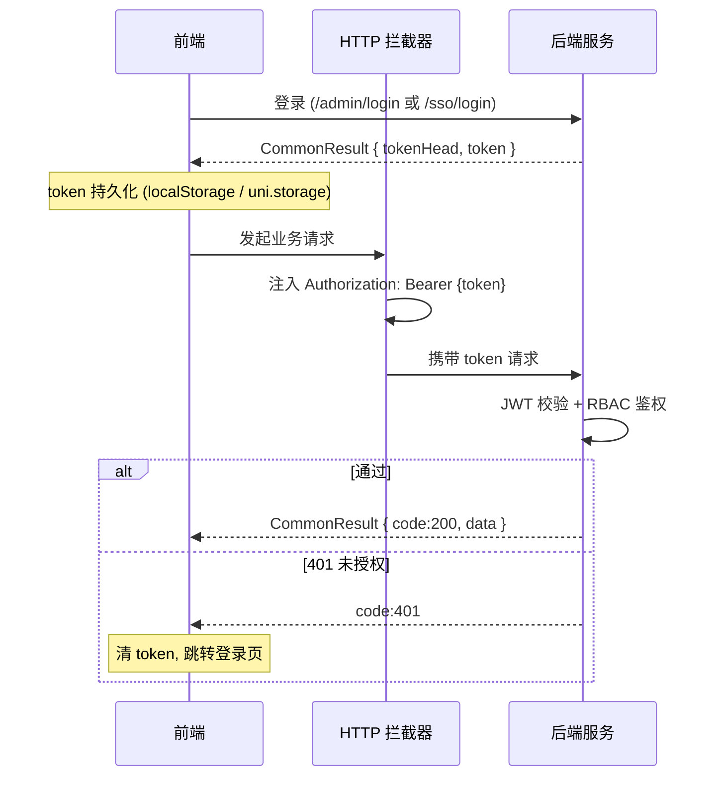

# mall 电商系统架构图

> 参考开源项目 [macrozheng/mall](https://github.com/macrozheng/mall) 及其配套前端 mall-admin-web、mall-app-web 的实现逻辑整理。
> 三个参考项目位于 `0resource/` 下：`mall`（后端）、`mall-admin-web`（后台管理前端）、`mall-app-web`（移动端商城前端）。

## 1. 系统总览

后端为一套 Maven 聚合工程，拆分出 3 个可运行服务（admin / portal / search）+ 3 个共享库（common / mbg / security）。前端分两套：PC 后台管理（Vue3 + Element Plus）与移动端商城（uni-app + Vue3），分别对接 admin 与 portal 服务。

## 2. 后端模块依赖关系

| 模块 | 类型 | 职责 |
|------|------|------|
| mall-common | 共享库 | 通用响应封装 `CommonResult`、Redis 封装、Swagger 配置、AOP 日志 |
| mall-mbg | 共享库 | MyBatis Generator 生成的 76 个 Mapper + 76 个实体 model，对应 MySQL 表 |
| mall-security | 共享库 | Spring Security + JWT 认证、动态权限（RBAC）共享逻辑 |
| mall-admin | ★可运行 | 后台管理 REST API（31 Controller），文件上传 MinIO/OSS |
| mall-portal | ★可运行 | 用户端门户商城 REST API，含订单/支付/MongoDB/RabbitMQ |
| mall-search | ★可运行 | Elasticsearch 商品搜索服务 |
| mall-demo | 演示 | 框架演示，非生产 |

## 3. 后端分层结构（以 mall-admin 为例）

- 辅助包：`dto` / `bo` / `config` / `validator`
- portal 额外有：`repository`（MongoDB）、`component`（RabbitMQ 死信队列、支付、定时任务）、`domain`
- 分页统一用 PageHelper；接口文档 Springfox Swagger UI 3.0.0

## 4. 业务域划分

| 域 | 全称 | 覆盖业务 |
|----|------|----------|
| **pms** | Product Management | 商品、品牌、分类、属性/规格、SKU 库存 |
| **oms** | Order Management | 订单、发货、退货、超时取消、收货地址 |
| **ums** | User Management | 管理员/会员账号、角色、菜单、资源、RBAC、会员等级 |
| **sms** | Sales/Marketing | 优惠券、限时秒杀、首页广告/品牌/新品/推荐/专题 |
| **cms** | Content Management | 专题 Subject、编辑精选区 PreferenceArea |

## 5. 前端架构

### 5.1 mall-admin-web（后台管理）

- **技术栈**：Vue 3.5（Composition API）+ TypeScript 5.9 + Vite 7 + Element Plus 2.12；Vue Router 4（Hash）+ Pinia 3（持久化）+ Axios；ECharts、TinyMCE 富文本
- **分层**：`apis/`（按实体拆分接口）→ `utils/http`（Axios 实例）→ 后端；`views/`（按 pms/oms/sms/ums 分包）、`router/`（静态 + 异步权限路由）、`stores/`（user/permission/app）
- **对接后端**：mall-admin，`VITE_BASE_SERVER_URL`（dev `:8082`），未用 proxy 直连
- **鉴权**：登录 `/admin/login` 拿 `Bearer` token 存 Pinia + localStorage；拦截器注入 `Authorization`；登录后 `/admin/info` 取 roles+menus，按菜单动态 `addRoute`（RBAC）

### 5.2 mall-app-web（移动端商城）

- **技术栈**：uni-app 3 + Vue 3.5 + TypeScript + Vite 5；uni-ui；`pages.json` 声明式路由 + Pinia 2（持久化）；自封装 `uni.request` 的 http（非 axios）；vue-i18n
- **分层**：`apis/`（home/product/cart/order/member…）→ `utils/http`（`uni.addInterceptor` 拦截）→ 后端；`pages/`（按业务域分目录）、`stores/`（member/search）
- **对接后端**：mall-portal，`VITE_API_BASE_URL`（dev `:8085`），固定头 `source-client: miniapp`
- **鉴权**：登录 `/sso/login` 拿 `Bearer` token 存 `uni.storage`；拦截器注入 `Authorization`；401 清登录态跳登录
- **主导航**：首页 / 分类 / 购物车 / 会员中心（tabBar）；商品、品牌、订单支付、会员中心各功能页

## 6. 请求鉴权时序（通用）

